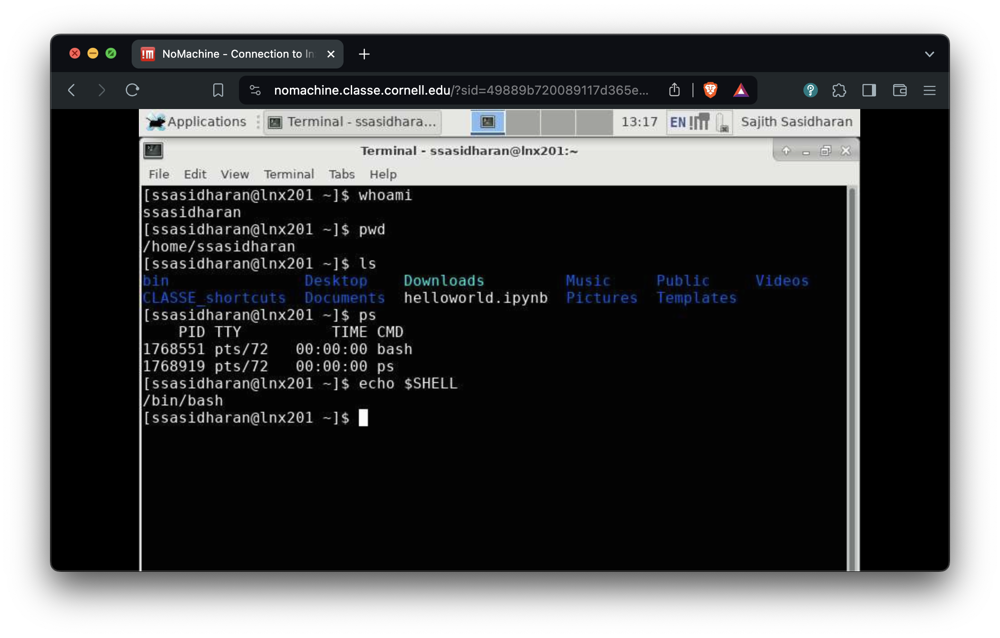
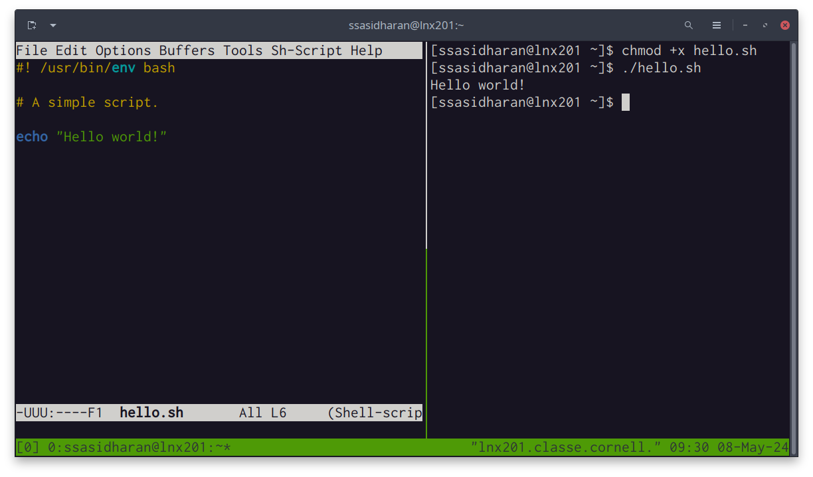

# Preliminaries

Getting into CLASSE Linux systems

## Assumptions

- You have your CLASSE accounts set up.
- Talk to staff if do not have a CLASSE account.

- Options:

  - Use ssh
  - Use NoMachine
  - Use JupyterLab

## Use SSH

`ssh ${username}@lnx201.classe.cornell.edu`

## Use NoMachine

<https://wiki.classe.cornell.edu/Computing/NoMachine>

## Use JupyterLab

<https://jupyter01.classe.cornell.edu/>

# Linux, command line, etc.

## Linux

- A fairly popular operating system.
  - (Actually an OS kernel, plus userland from various other projects.
    But those are details...)
- Unix-like, therefore has accumulated quirks.
  - Expect "hysterical raisins".

## `lnx201`

- The Linux host we'll be using is `lnx201.classe.cornell.edu`.
- Runs a _distribution_ called Scientific Linux.
- Good enough for general use.
- Do not run anything resource heavy on `lnx201`.

## The command line

- You will type _commands_ in a _shell_ (text user interface), hint
   key, and then things happen.

- (As opposed to clicking on GUI widgets.)

## Commands

- Commands are either programs or shell builtins.
- Use one of these commands to get some documentation:

  - `man ${command}`
  - `info ${command}`
  - or `${command} --help` (sometimes!)

# The shell

## Bash

## Environment variables

# Files and directories

## Directory navigation

## Wildcards

## The current working directory

## Fun facts about file names

## Standard input, output, and error

## I/O redirection

## Pipes

## Symbolic links

# Users and Groups

## Permissions and ownership

## Changing permissions

# Processes

## Background and foreground processes

## Terminating processes

## Signals

# Shell Scripting

# Other tools of the trade

## Text editors

Many choices! Use:

- Emacs
- Vim
- Nano
- JupyterLab

## Terminal multiplexers

