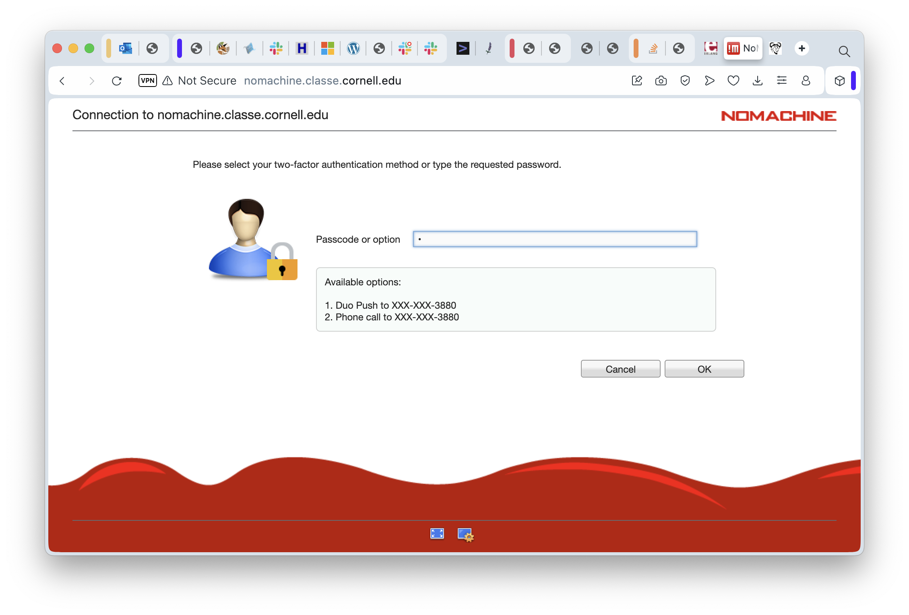
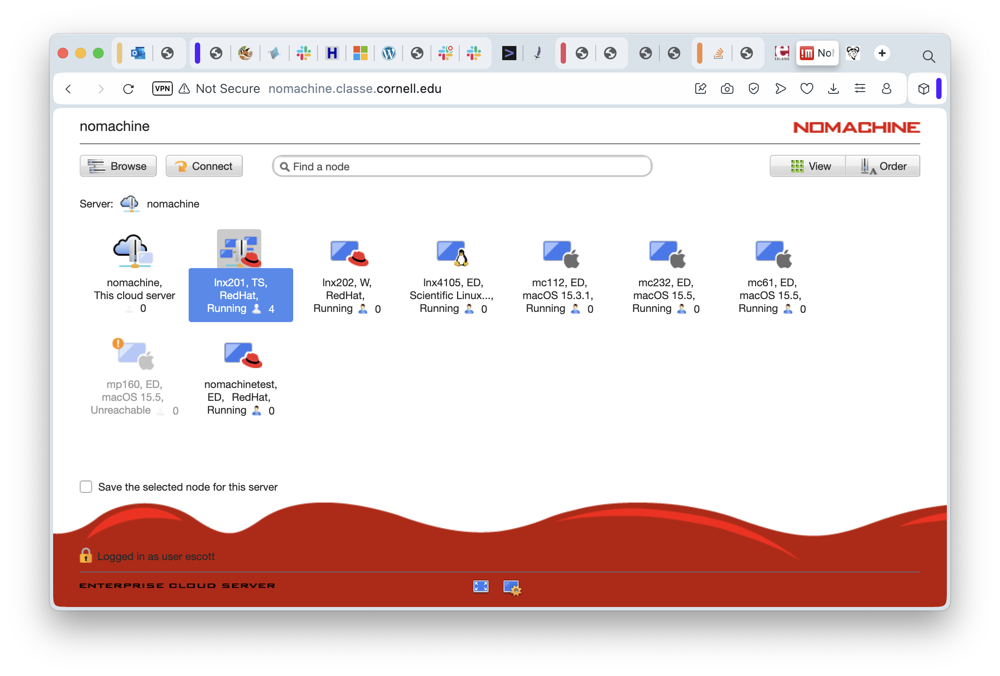
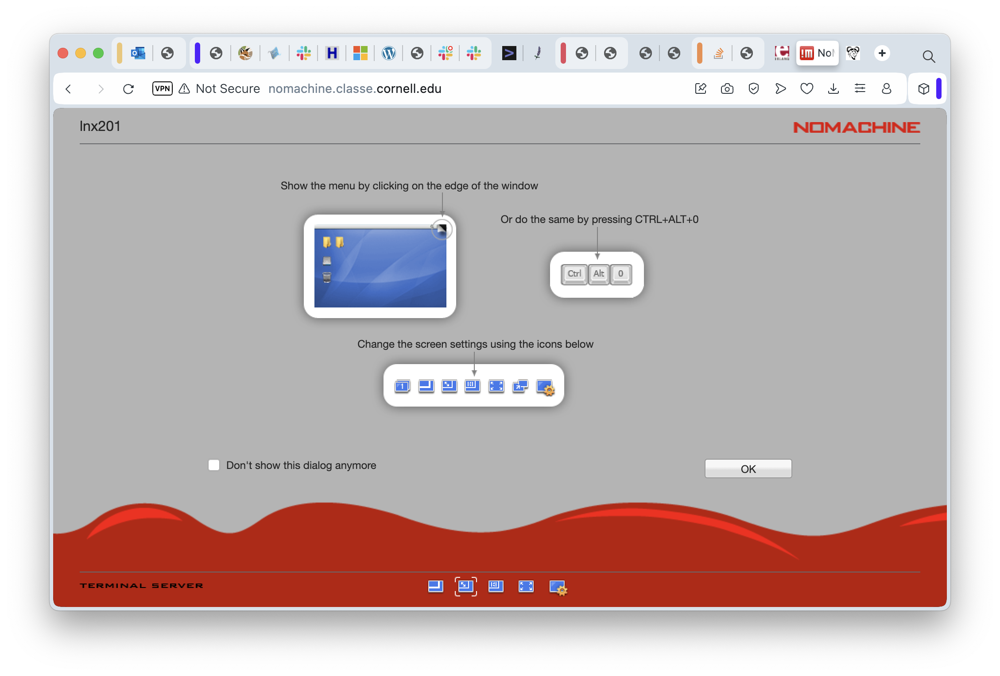
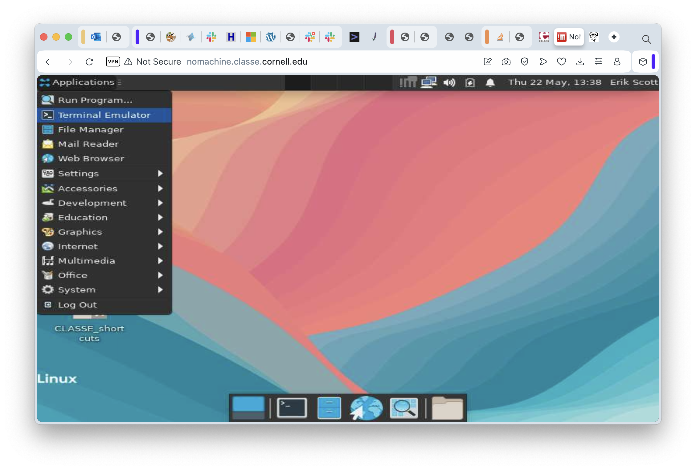
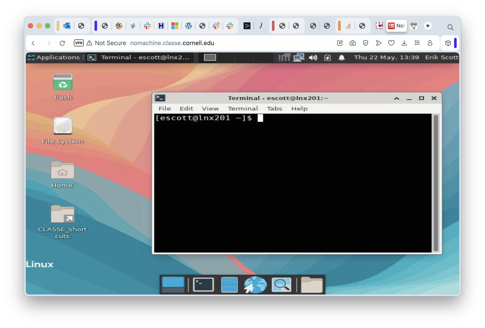
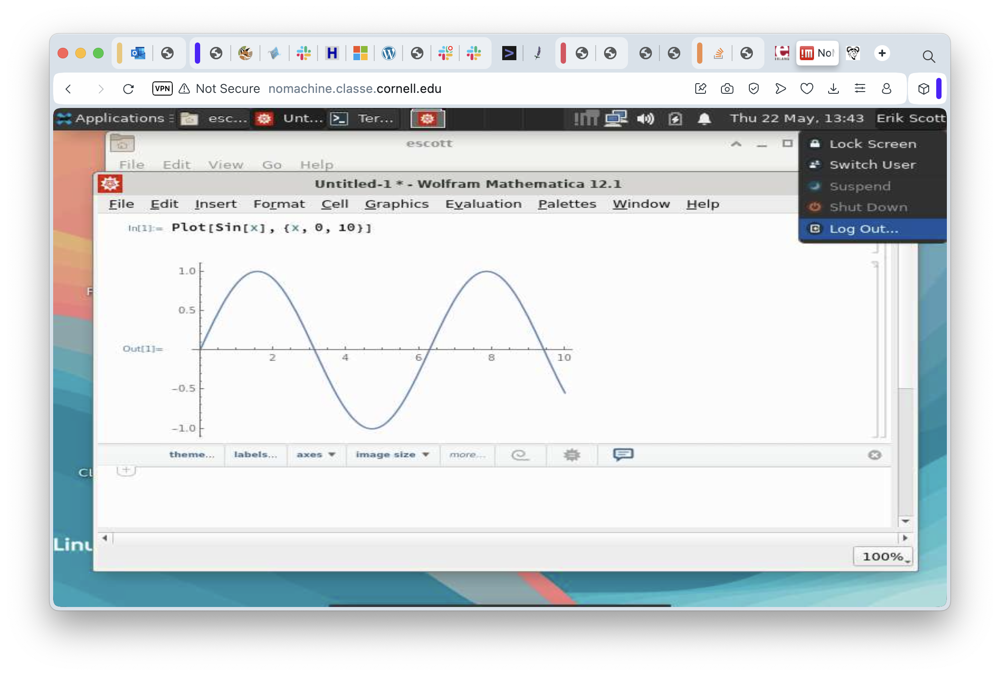

In the course of your research at CHESS, you'll need to do a lot of
computation. What constitutes "a lot" is discipline-specific and
varies tremendously depending on what the exact processing is. It's
entirely possible that much of your work can be completed on your
laptop. On the other hand, it's also likely that at least some, and
possibly a great deal, of your computing will need to be done on the
Linux cluster. In simple terms, the cluster is a collection of
machines running Linux (a variant of Unix) and able to coordinate
workflows, assigning the running of "stuff" to an appropriate server
at the right time.

While there are many servers in the cluster, one of them is
special. It's name is "LNX201", and it's responsible for accepting new
jobs and dealing with the output. It's also the right server to use
for developing your programs. Keep in mind that dozens of people may
be using LNX201 at the same time, so don't use it for running lengthy
computations.  If your job runs for more than a few seconds, it's
probably time to learn how to run it on some of the worker nodes.
We'll talk about that subject in SF201 when we get our first look at
batch processing. Until then, we'll keep our examples comfortably
small and LNX201 will be the perfect home.

### Remote Desktop Access

Why do we need remote access at all? My laptop has a pretty decent
processor, nice graphics, and a tolerable keyboard. Why don't I just
use that? The answer, or one of the answers, is that the computers in
the cluster are larger and more powerful. LNX201 has 16 CPUs ("cores", sort
of) and 128 gigabytes of RAM. Each of the cores in the server are
several times faster than the ones in a laptop. In short, the compute
cluster can handle jobs that would bring a laptop to its knees, fans
screaming, too hot to handle.

There are two kinds of remote access and both have their strengths and
weaknesses. The first approach we'll look at is the "virtual
desktop". This strategy takes the full graphical experience of using a
computer, potentially in a far-flung destination, and shows what is
going on right in front of you. The effect is to make your computer's
screen, keyboard, and mouse act like they're connected to the remote
machine, albeit with a really, really long set of cables. The second
remote access approach is to use a program on your laptop or desktop
to connect over the network to a remote machine and just pass
characters back and forth. It gives you, for all practical purposes,
something that looks like a window for using the command line, only
the computer running those commands is remote.

### Virtual Desktops - NoMachine

CHESS uses a software system called "NoMachine" for remote Virtual
Desktop access.  NoMachine has oodles (a scientific term) of features
and configuration settings, but if you just want a basic Virtual
Desktop that is good enough for all but a few special cases then you
can just play on Easy Mode: use the web client that runs inside a
browser and just take the default settings.

The rest of this lesson assumes you have:
1. A CLASSE username and password
2. The DUO app installed on your phone and configured for access to CLASSE
3. The "Pritunl" Virtual Private Network software installed on your laptop.

The instructions for each of these steps are in the very first steps shown in
[CLASSE-IT 2025 Summer Student Guide][classe-summer-student].

[classe-summer-student]: https://wiki.classe.cornell.edu/Computing/SummerStudentOrientation
[nomachine-classe]: https://nomachine.classe.cornell.edu

Go ahead and connect to the CLASSE internal network through the
Pritunl VPN software. Then go to your web browser and put in the
destination URL
[https://nomachine.classe.cornell.edu][nomachine-classe]. In just a
moment, you should be seeing the initial login screen for NoMachine
itself. Put in your username and password, then click on "OK" in the
lower right corner.


This starts the login process, the next part of which is using DUO for two-factor authentication:



On this screen, enter a "1" if you want to use the Duo app on your
phone. Otherwise, you can enter "2" and the Duo servers will call you
to verify that the person trying to log in at least controls that
phone number. If you selected "1", then in just a moment your phone
will beep, you can go to the Duo app, and click the green button to
approve of the login request.  Completing the Duo process will take
you to the next screen.



In this screenshot, I've already selected "lnx201" so you can spot it
right away. This is the one you'll want to use. Go on and double click
it to start logging in to LNX201. You'll see a screen listing the
available session types. In principle you could confighure different
graphical environments here, but in reality you should just take the
default.


Clicking OK on that will take you a quick reminder of some commands
that might be useful when you're connected. There is a checkbox you
can select when you get familiar with this and that will keep this
screen from showing up again.



In the meantime, click OK to continue to the next helpful screen:


And then OK again to see a screen with some helpful advice, to be
sure, but also a chance to select how the screen resolution should be
handled.


On this screen I have selected the first option, "Scale the remote
desktop to fit into the window", because I like being able to change
the size of my browser window and yet still see the same amount of
screen space on the remote machine. Try different options here - you
won't break anything. Clicking "OK" will take you to the final
information-and-setup screen:


This screen gives options for setting up the screen resolution on the
remote computer. Because LNX201 is a server and not a machine with an
actual graphics card and a monitor, all the sessions use simulated
(virtual) desktops and that means they can be set to any resolution you
want. Selecting "Don't resize" is a reasonable starting point. You
might want to experiment with the others later. In any case, we can
finally click on "OK" for this screen and connect to the desktop
session!


It may take a moment for everything to start up, and another moment
for the remote screen drawing to catch up, but pretty soon you'll see
a Linux desktop environment. Desktop environments have mostly
converged on roughly the same concepts. The one you see here is
"Xfce", and it traces its heritage to the great Unix Workstations of
the 1980s. MacOS, similarly, is derived from NeXTstep which is based
on work on Unix Workstations in the 1980s. Various versions of Windows
are based on... you get the idea. They're all more alike than
different.

Ironically, perhaps, the most common thing we'll do on a remote desktop
session is "start a terminal window". In this case, the task is dead simple:
click on the "Applications" menu and select the "Terminal Emulator"
item.



In just a moment, the terminal window appears:



Just as you would expect, we have a file browser available and it's
more or less equivalent to Windows' Explorer or to the Mac's
Finder. Double Click on the "Home" folder...


Quite a few applications are already installed in the Linux cluster,
some of which can really take advantage of having graphics through a
remote desktop environment. One example is Mathematica:


At this point, we've seen how to log in to the Linux cluster through a
virtual desktop session, seen how to move around just a bit in that
graphical environment, and teased ourselves with a bit of mathematical
loveliness.  All good things must come to an end, eventually, and this
session is no exception. When you're ready to go, click on your name
in the upper right corner of the desktop, select the "Log Out..." menu
item, and log off. This will cause the session to end and you'll go
back to the initial login screen for NoMachine.



Now that we've gone through the basics, there might be (should be?)
one nagging... consideration. Doesn't this seem like a fairly
complicated and not terribly fast way to use to use a Linux machine
remotely if all I want to do is work in a terminal session?

Yes. Yes it is.

Fortunately, there's another way. It's called "SSH".


### Remote Terminal Access with SSH

To have a good understanding of SSH, you need to know just a little
bit about the history of Unix (and Linux is just a modern version of
Unix). In the Old Days (1974-ish) Unix ran on a machine the size of
home refrigerator and the server didn't even have a keyboard. To
interact with it, teletypes were plugged into serial ports on the back
on the computers. Users performed all of their interaction with the
machine by pressing a key on the teletype (sending a character) and
waiting for the computer to send back characters to be printed. By the
late 1970s, teletypes were getting rare quickly because they had been
replaced by "terminals" (a keyboard, a picture tube, and enough
electronics to draw the characters on the screen). The connection to
the computer was still a serial cable. To this day, you can plug a
USB-to-Serial converter into a Linux machine, plug in a teletype or a
terminal, set up a configuration file, and use the computer like it's
1979. It's fun a time or two, but the novelty wears off.

Serial cables had a length limitation and a speed one. Half a mile was
easy (9600 bits per second, even!) but a mile was getting unreliable
at any speed much over 1200 bits per second. Beyond a mile, longer
distances required all sorts of interesting hardware and lots of
special cables. Covering a whole campus required a network of some
sort, and what the research and academic world standardized on was
"Internet Protocol" (IP). One of the first programs ever written for
IP was a program called "telnet". This program used the network to set
up a stream of characters to and from a remote machine to the local
one. It was like having a serial cable, except it was literally a
thousand times faster and could reach around the world. To this day,
telnet is still the "official" way to use Internet Relay Chat
(IRC). Plus, it makes you look cool.

Telnet was great in the early days of networking. But we were so naive
back then. Anyone who could get access to the network could eavesdrop
on whatever communications was going over these telnet
connections. Most of the traffic was utterly boring - email, Unix
commands, that sort of thing. But there was one thing worth snooping
on, and it was the first two things a user typed when they set up a
connection: their username and their password.  In the late 1980s and
early 1990s, this was mostly a theoretical concern. The problem was
the explosive growth of the Internet in the "Dot Com" era
(1995-2000). Once there were a critical mass of Internet users, and
once these users started using the Internet for things that were
_worth actual money_, security started moving front and center. By
this point, sending anything over the internet without encrypting it
became a VBA (Very Bad Idea). Thus was born the *S*ecure *SH*ell
(SSH).

The simple explanation of SSH is "it's just telnet, except all the
communication is encrypted". This statement is true, in the sense that
SSH replicates every telnet function, but SSH also does some other
tricks. For our purposes, we're going to keep it simple and just use
it like a "better telnet".

To use SSH on your computer, you need to bring up a "Terminal Window"
(Mac) or "Command Window" (Windows). On a Mac, use Finder to browse
the Applications folder. In there, open the Utilities folder, then
double click on Terminal. (After a while, you might decide to just use
Spotlight to search for Terminal.app, but it's up to you). On a PC,
the easiest thing to do is press and release the "Windows" key, then
type "cmd" and press enter. That will bring up a command window.

Either way, you're now looking at a terminal window of some
sort. Characters are entered and sent to programs, and programs
send characters back out and the terminal window draws them on the
screen. Just like a teletype, except no paper and no oily
smell. Windows users will probably see something similar to
```C:\>```.  Mac users will see something more akin to
```escott@RENCI_LP91DX62MX ~ %```.  Both of these are "prompts",
meaning "you can type a command here". In both cases the command to
type is ```ssh lnx201.classe.cornell.edu```. The lower case letters in
"ssh" are important. Linux commands _almost_ never contain uppercase
letters. Go ahead, enter that ssh command, and press Enter.  If this
is the very first time you've ssh'ed into lnx201 from the machine
you're at, you'll get some warnings just to remind you to be wary:

```
The authenticity of host 'lnx201.classe.cornell.edu (128.84.45.81)' can't be established.
ED25519 key fingerprint is SHA256:cIplmL7rqVGlAKYlTwtfml+KiSvUuBhgKuyjkPbde7E.
This key is not known by any other names.
Are you sure you want to continue connecting (yes/no/[fingerprint])?
```

You can type "yes" here and press enter, and ssh will tell us it's
storing that cryptographic fingerprint. The "fingerprint", by the way,
refers to a encrypted, secure way to tell we're really using the
server we think we are. It has nothing to do with ridges and swirls on
our fingertips. We're going to assume no one has hijacked the actual
name of the server and put up a fake one. There is a way to protect
against this, but it's a (minor?) hassle so it's rarely done.
Since we're doing this the rough-and-ready way, ssh informs us it's
going to store a cryptographic "fingerprint" for the server. It will
check that fingerprint every time we try to connect in the future and
make sure it matches. If it doesn't, it'll warn us to be suspicious
and not continue until we're at least comfortable we know why.

Whether it needs to notify us of anything or not, it will always
prompt with the following:

```
(escott@lnx201.classe.cornell.edu) Password:
```

At this point, type your password. Nothing will appear as you're
typing, not even any little dots. When you think about it, teletypes
didn't have any little dots.

If you type your password correctly, you'll see one more prompt:

```
(escott@lnx201.classe.cornell.edu) Duo two-factor login for escott

Enter a passcode or select one of the following options:

 1. Duo Push to XXX-XXX-3880
 2. Phone call to XXX-XXX-3880

Passcode or option (1-2):
```

Enter a "1" and press enter. You'll hear Duo chiming on your
phone. Approve your login, let all of that percolate through the
system for a second, and you'll see your command line prompt on
LNX201:

```
[escott@lnx201 ~]$
```

At this point, you can run all of your favorite commands: ls, mkdir,
the whole bunch. When you are done, don't forget to log out. The
"exit" command logs you out and breaks down the SSH connection.


### Parting Shot, and a Note to the Nerds

We've just looked at two very different ways to remotely access the
CLASSE Linux servers that CHESS uses. The remote desktop approach,
using NoMachine, has the advantage of being relatively easy to use and
of fully supporting graphical programs but at the expense of
potentially quite a bit of lag time between doing something and seeing
the results on the screen. Using SSH, on the other hand, will usually
feel more responsive and use less network bandwidth but is for command
line use only - no graphics. Which one to use is a matter of deciding
what tradeoffs are acceptable. If you're on campus then bandwidth
isn't an issue. Use both - no one will judge you. If you're out in the
boondocks and getting network connectivity through a bad cellphone
connection then you might want to use SSH.

SSH has a few more tricks up its sleeve. One is that it can copy
files. When you copy files this way you use the "scp" command instead
of "ssh", but it's really the same program behind the scenes. Another
trick is that it can do "port forwarding" - a poor substitute for a
VPN, but sometimes you're in a situation where you're not allowed to
install a VPN to get to your instrument, for instance. And finally,
yes, I have to acknowledge this for the nerds who've been waiting to
ambush me... ssh _can_ be used to run graphical programs remotely. The
"-X" and "-Y" options are the relevant ones. Results are "good enough"
for simple programs over very fast networks, but slower networks make
the experience miserable and complicated graphical programs (Chrome?
Just saying.) are awful no matter how fast the network is.


_Coming up next, we'll use these remote connections to start learning
about command line tools and how to use them. _


