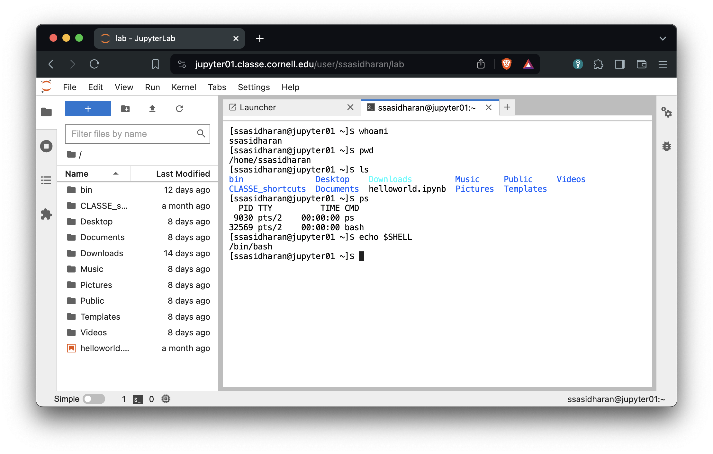
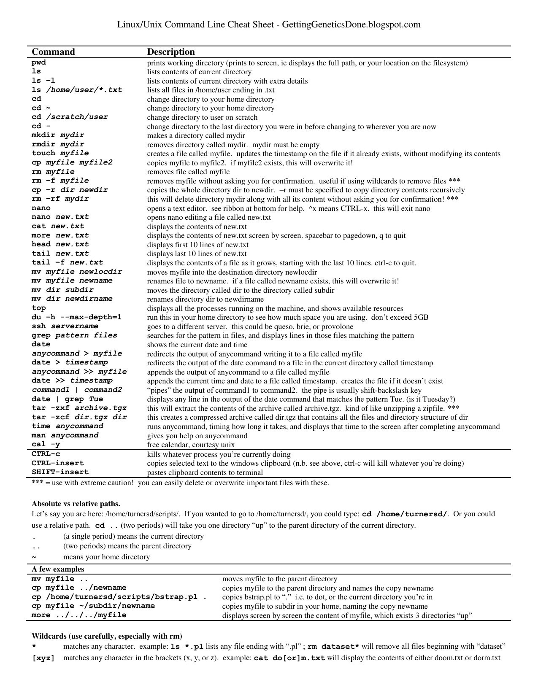

# Preliminaries

Getting into CLASSE Linux systems

## Assumptions

- You have your CLASSE accounts set up.
  - Talk to CLASSE staff otherwise!

- Options:

  - Use ssh
  - Use NoMachine
  - Use JupyterLab


## Use SSH


`ssh ${username}@lnx201.classe.cornell.edu`


## Use NoMachine


<https://wiki.classe.cornell.edu/Computing/NoMachine>


## Use JupyterLab



<https://jupyter01.classe.cornell.edu/>


# Linux, command line, etc.

## Linux

- A popular operating system.
  - (Actually an OS kernel, plus userland from various other projects.
    But those are details...)
- Unix-like, which traces back to 1969, therefore has accumulated
  quirks.
  - Expect "hysterical raisins".

## `lnx201`

- The Linux host we'll be using is `lnx201.classe.cornell.edu`.
- Runs a **distribution** called Scientific Linux.
- Good enough for general use.
- Do not run anything resource heavy on `lnx201`.


## The command line


- You will type **commands** in a **shell**, hint
   key, and then things happen.

  <!-- - All of this is a text user interface. -->
  <!-- - As opposed to clicking on GUI widgets. -->

## Commands

- Commands are either **programs** or **shell builtins**.
- Use one of these commands to read documentation:

  - `man ${command}`
  - `info ${command}`
  - or `${command} --help` (sometimes!)

## The shell

- A program that accepts commands, and passes those commands to the OS
  to execute.
- A popular shell is `bash`, which is the default on `lnx201`.


## Bash

- "Bourne-again shell"
  - Based on an earlier Bourne shell, thus the "again".
  - Developed by the [GNU project][gnu].
  - On `lnx201`, `/bin/bash` is the program.
- For documentation: `info bash` or `man bash`.

[gnu]: http://gnu.org/


<!-- ## Environment variables -->

# Files and directories

Unix slogan: Everything is a file!


## Directory navigation

```{.bash}
[ssasidharan@lnx201 ~]$ tree -d -L 1 /
/
├── bin -> usr/bin
├── boot
├── cdat
├── cifs
├── cvmfs
├── dev
├── etc
├── home
├── lib -> usr/lib
├── lib64 -> usr/lib64
├── media
├── misc
├── mnt
├── net
├── nfs
├── opt
├── proc
├── root
├── run
├── sbin -> usr/sbin
├── srv
├── sys
├── tmp
├── usr
└── var

25 directories
```

## Your home directory

- You have a "home" directory.
- Usually `/home/$USER`
   - Also `$HOME`
- You can write your files and create directories here.

<!--

   - Don't write too much when on `lnx201` though...

TODO: double check with werner

## your home directory on `lnx201`

-->


## The current working directory

"Wherever you go, there you are"

- At any time in the shell, you are "inside" a single directory,
  called the **current working directory**.
- When you log in, your current work will be `/home/${username}`.
- You will use `cd` (change directory) to move around.
- Use the command `pwd` to find where you are.


## Absolute and relative paths

- **Absolute path names** begin with the root directory, `/`.
   - Example: `/home/ssasidharan/Documents/hello.txt`

- **Relative paths** start with the working directory.
   - Example: `./Documents/hello.txt` (or just `Documents/hello.txt`)
     when I'm in my home directory.

## Fun facts about file names

- Names that begin with "." are "hidden".
  - Omitted from directory listing when you do `ls`.

- `.` and `..` are special directory names.
  - `.` stands for the current directory.
  - `..` stands for the directory above the current directory.
  
  
## More fun facts about file names
  
- File and directory names are case sensitive.
  - (Depends on filesystem, but that is a detail.)
- Better to avoid spaces in file names, because they are a hassle.
  - Use `_` (underscore character) instead (example: `file_name`), or
    CamelCase (example: `FileName`).

## Wildcards

Some characters are given special treatment:

- `*` matches any set of characters.


```{.bash}
[ssasidharan@lnx201 ~]$ ls /usr/bin/ab*
/usr/bin/ab  /usr/bin/abs2rel
```

- `?` matches any one character.

```{.bash}
[ssasidharan@lnx201 ~]$ ls /usr/bin/?abc*
/usr/bin/kabc2mutt  /usr/bin/kabcclient
```


## Standard input, output, and error

- Input is read from **standard input** (or `stdin`).
- Output is written to **standard output** (or `stdout`).
- Error messages are written to **standard error** (or `stderr`).

::: {.callout-note}

They are files too: `/dev/stdin`, `/dev/stdout`, and `/dev/stderr`.

:::

## I/O redirection

You can redirect `stdout` to a file with `>` operator:

```{.bash}
[ssasidharan@lnx201 ~]$ ls -l > ls-output.txt
```

Or append with `>>`:

```{.bash}
[ssasidharan@lnx201 ~]$ ls -l >> ls-output.txt
```

To direct a file to a programs input, use `<` operator:

```{.bash}
[ssasidharan@lnx201 ~]$ cat < sonnet18.txt
Shall I compare thee to a summer’s day?
```


## Pipes

- Using the `|` ("pipe") operator, you can "chain" programs such that
one programs output is another programs input:

```{.bash}
[ssasidharan@lnx201 ~]$ ls -l /bin/ | less
```

- You can create longer pipes:

```{.bash}
[ssasidharan@lnx201 ~]$ ls /bin /sbin | sort | uniq | wc
   4289    4288   46820
```

<!--

## Symbolic links

- Special files that point to other files/folders.
  - Kind of like shortcuts

-->


# Users and Groups

## You belong (to groups)

Your account belongs to several groups:

```{.bash}
[ssasidharan@lnx201 ~]$ id
uid=63499(ssasidharan) gid=262(chess) groups=262(chess),750(classeuser)
[ssasidharan@lnx201 ~]$ groups
chess classeuser
```

## Permissions and ownership

Do a "long" file listing (with `ls -l`) and behold:

```{.bash}
$ ls -l
total 8
drwxr-xr-x  2 ssasidharan chess   44 May  8 10:42 bin
drwxr-xr-x  2 ssasidharan chess  144 Mar 12 00:27 CLASSE_shortcuts
drwxr-xr-x  2 ssasidharan chess   52 Apr  2 00:27 Desktop
drwxr-xr-x  2 ssasidharan chess   28 Apr  2 00:27 Documents
lrwxrwxrwx  1 ssasidharan chess   31 Mar 26 15:21 Downloads -> /cdat/tem/ssasidharan/Downloads
drwxr-xr-x  2 ssasidharan chess   28 Apr  2 00:27 Music
drwxr-xr-x  2 ssasidharan chess   28 Apr  2 00:27 Pictures
drwxr-xr-x  2 ssasidharan chess   28 Apr  2 00:27 Public
drwxr-xr-x  2 ssasidharan chess   28 Apr  2 00:27 Templates
drwxr-xr-x  2 ssasidharan chess   28 Apr  2 00:27 Videos
```

What do those characters mean?


## Changing permissions

- Use `chmod` command to change file mode bits (the first column in
  the previous listing).

```{.bash}
[ssasidharan@lnx201 ~]$ chmod +x test.sh
[ssasidharan@lnx201 ~]$ ls -l test.sh
-rwxr-xr-x 1 ssasidharan chess 0 Mar 28 13:39 test.sh
[ssasidharan@lnx201 ~]$ chmod -x test.sh
[ssasidharan@lnx201 ~]$ ls -l test.sh
-rw-r--r-- 1 ssasidharan chess 0 Mar 28 13:39 test.sh
```

- Use `chown` and `chgrp` commands to change owner and group (the
  third and fourth columns in the previous listing).
  - Probably not immediately useful; just know that they exist.


# Processes

## Listing processes

- List running processes using `ps` command:

```{.bash}
[ssasidharan@lnx201 ~]$ ps
    PID TTY          TIME CMD
 694411 pts/81   00:00:00 ps
3479688 pts/81   00:00:00 bash
```

The four columns:

- `PID` is process id.
- `TTY` is the terminal associated with the process.
- `TIME` is the elapsed CPU time for the process.
- `CMD` is the command that created the process.


(Also see: `top` and `htop`.)

## Background and foreground processes

- Some processes run in the foreground:
   - They read input, write output, etc.
   - Attached to a terminal.
- Background processes, well, run in the background.  Send things to
  the background with `&`:

```{.bash}
[ssasidharan@lnx201 ~]$ sleep 100 &
[1] 949751
```

- Bring a background process to foreground using `fg` command, and
terminate it using :

```{.bash}
[ssasidharan@lnx201 ~]$ fg 2
sleep 100
^C
```

## Terminating processes

- `kill PID` command to end one process.
- `killall` command to end many processes

<!--

## Signals

-->

# Other tools of the trade

## Text editors

Many choices! Use:

- Emacs
- Vim
- Nano
- JupyterLab


## Terminal multiplexers


# Shell scripts

## Hello world!

```{.bash filename=hello.sh code-line-numbers="true"}
#! /bin/bash

# A simple script.

echo "Hello $USER!"
```

- Make the thing executable with `chmod +x hello.sh`
- Run the thing with `./hello.sh`

## Other things

Bash supports a programming language with:

- Conditionals (with `if` statements)
- Loops (with `for` and `while` statements)
- Et cetera
- Take a peek at `/etc/bashrc` for a taste

BUT

- This is another topic, not really in scope of this presentation
- We're likely out of time anyway


# Some resources

# A cheat sheet

[{height=600}](cheat-sheet.pdf)


(Via [Stephen Turner][cheat-sheet-source].)

[cheat-sheet-source]: https://gettinggeneticsdone.blogspot.com/2009/03/linux-command-line-cheat-sheet.html


# Resources elsewhere

- [Shell Tools and Scripting][missing] module of MIT "The Missing
  Semester of Your CS Education" class.
- [The Linux Command Line, A Complete Introduction][tlcl] by William
  E. Shotts, Jr.  The book is freely available under a Creative
  Commons license, and contains a good discussion about shell
  scripting.
- [The Unix Programming Environment][tupe] by Brian W. Kernighan and
  Rob Pike.  Good old classic, still useful.  Places things in a
  historical context.


# Fin!

[missing]: https://missing.csail.mit.edu/2020/shell-tools/
[tlcl]: http://linuxcommand.org/tlcl.php
[tupe]: https://archive.org/details/UNIXProgrammingEnvironment
