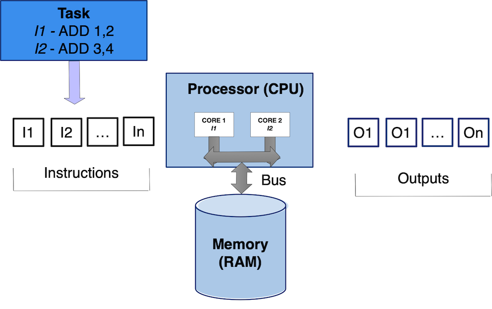

::: {.callout-note}
This page is work in progress.
:::

These notes give you a brief overview of concepts of distributed computing. 
If you are at this chapter, it is assumed that you are familiar with writing 
scientific code for your analysis and are able to run it locally on your 
machine (laptop/desktop).

For purposes of this discussion, it is important to review some terminology.

- A **program** or code that you run is comprised on instructions.
- A **task** is a program or code that you need to execute.
- **Processor** is any device that can process instructions. CPU's and GPU's
  are types of processors.
- **CPU** is the main entity in a computer that executes instructions. 
- Newer CPU's have multiple cores. **Core** is a single independant processing
  unit within the CPU.

## Serial Computing

Serial computing can be defined as executing instructions in a sequential 
order as laid out in your program. The order in which the instructions are
executed is important and critical for correctness. 

In serial computing your program runs on a single CPU/processor and speed
at which your programs runs is directly proportional to the CPU's processing
power which is usually measured in Clock cycles per second (Hz). A 1 Hz CPU
does 1 clock cycles per second. You can consider for discussion purposes

* 1 instruction takes 1 cycle to to get executed (not always true)
* The clock speed defines how fast your CPU can execute instructions. 
* So a 1Gz CPU can execute 1 billion instructions per second!

## Parallel Computing

In parallel computing you can leverage multiple CPU's or cores to execute
your program. It involves breaking down a problem into smaller, independent
sub-tasks that can be processed simultaneously by multiple processors or cores.
Remember modern day processors/CPU's are now comprised of multiple cores which
can act independently, allowing use to execute instructions in parallel.

Parallel computing can often be achieved by either leveraging

* **Threads:** Threads are light-weight sub-processes, that have access to your 
  program global memory. Threads allow you to leverage the multiple cores on a 
  processor/CPU. Threading needs be done carefully, as data is shared across threads
  and a thread can easliy modify data that another thread maybe using resulting in
  crashes or deadlocks.
* **MPI:** Message Passing Interface(MPI) allows independant processes to access a 
  shared global memory via a message interface. This allows processes to control  
  what data is shared and which is private to the process. Using MPI you can 
  either use cores on a single CPU, or also use cores across multiple CPU's in
  a high performance computing cluster, where the CPU's are connected via a
  high speed network such as infiniband.

Even though you can acheive serious performance gains using parallel computing, it
is generally considered hard and error prone. Various reasons contribute to it such
as harder debugging, memory coherence issues etc. Also as humans, we are better
at thinking sequentially. 

## Distributed Computing

Distributed computing involves leveraging multiple computers that are connected via
a local area network or a wide area network to solve a problem that you cannot 
solve on a local computer. For example, if you do a google search the search request
gets broken down and distributed amongst various nodes to get you the results
back.

Parallel and Distributed computing are often changed interchangeably. However, there
are subtle differences between the two. For example, in distributed computing there
is no shared memory to use. If anything, Distributed Computing should be viewed as
the superset (that could include Parallel Computing).

