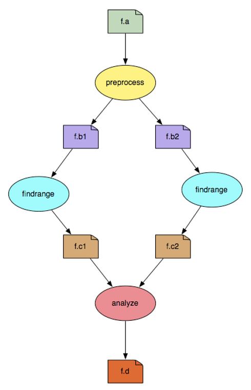
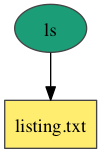
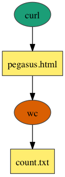
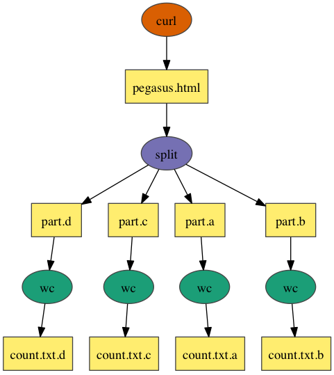
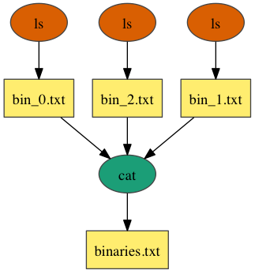

::: {.callout-note}
This page is work in progress.
:::

This module provides an overview on how a CHESS can use notion of workflows to automate
their data processing tasks and in the process shortening the turn around time for the
data processing that needs to be done on data collected at a beamline. 

The content in this module is gathered from author's various presentations over 
the years and their work on workflows.

## What are Scientific Workflows

Scientific workflows allow users to easily express multi-step computational tasks, 
for example retrieve data from an instrument or a database, reformat the data, and 
run an analysis. A scientific workflow describes the dependencies between the tasks
and in most cases the workflow is described as a directed acyclic graph (DAG), 
where the nodes are tasks and the edges denote the task dependencies.

A defining property for a scientific workflow is that it manages data flow. 
The tasks in a scientific workflow can be everything  from short serial tasks to 
very large parallel tasks (MPI for example) surrounded by a large number of small, 
serial tasks used for pre- and post-processing.



In the above example figure, the nodes/vertices in indicate the job that
needs to be run, while the edges indicate the dependencies between the jobs.

The dependencies can be both *control flow* or *data driven* i.e.
- a job can be run only after the parent has finished successfully OR
- a job requires data sets to run that are generated as outputs by a parent node/job.
- the rectangles in the figure indicate datasets that a node/job require and generate.

Using scientific workflows for your data processing in general provides you the 
following benefits

1. **Reproducibility** - Scientific workflows allow you to document and 
   reproduce your analyses, ensuring their validity.

2. **Automation** - Workflows automate repetitive and time-consuming tasks, 
   thereby reducing the workload of researchers.

4. **Scalability** - Workflows allow you to scale up your data processing to handle
   large data sets and complex analyses, enabling you to solve large research 
   problems in your field. It helps you run your analysis in parallel over distributed
   resources.

5. **Reusability** - Once your data processing pipeline is modelled as a workflow, 
   typically it is possible to reuse the workflow in different ways. For example, 
   you could use the workflow as part of a bigger science analysis (that maybe faclity 
  wide), or even share the workflow with another CHESS researcher.
   
### High Level Steps on Identifying a Workflow

Here are some tips on how you can identify a workflow for your data processing

- Start on a whiteboard and think about the various steps that your data processing
  entails. Especially when you already have existing monolithic code for data processing,
  it is important to think about your processing at a high level in a logical manner.
- Think about the various steps that make sense logically, and would also make sense 
  another CHESS researcher when discussing the problem. 
- Think about the granularity in context of input data. If a particular step in 
  your identified workflow, can benefit on working on smaller chunks of data; then 
  consider breaking down that step in smaller parallel sub steps. For example if you 
  are working on time series dataset, and you have a dataset collected for a month, 
  you can break down processing in chunks of 
  - per day
  - per hour
  - per minute
  - and so forth.
   
  What granularity makes sense is subjective. A good rule of thumb is that the step
  can easily run on a wide variety of compute nodes with reasonable memory. You don't
  want to model a workflow that can only run on a few extremely powerful nodes with
  lots of memory. In some cases this maybe **unavoidable**. However, it is always 
  good to think along these lines. 
- Often, each step (type of step) in your workflow would map to a different 
  executable.  

### Workflow Constructs

There are some core different types of workflow patterns that underpin most
of the complex workflows. The jobs in the examples, below map to simple
commonly available *linux executables* and is for illustration purposes
only. For your actual workflows, you use your actual scientific code. 

**Process**



In the above example, workflow consists of a single job that runs
the `ls` command and generates a listing of the files in the `/` directory.

**Pipeline**



In the above example, workflow consists of two jobs linked together in a pipeline. 
The first job runs the `curl` command to fetch the Pegasus home page and 
store it as an HTML file. The result is passed to the `wc` command, which 
counts the number of lines in the HTML file.

**Split**



In the above example, workflow consists of a job that downloads the Pegasus home 
page using the `curl` command,  then uses the `split` command to divide it into 4 pieces. 
The result is passed to the `wc` command to count the number of lines in each piece.

**Merge**



In the above example, workflow consists of 3 jobns that execute the `ls` command 
on several */bin directories and passes the results to the `cat` command, 
which merges the files into a single listing.

### Workflow Challenges 

When running workflows independent of what workflow system you are using, there
are some common challenges that you may encounter.

- **How to describe your complex workflows in a simple way?** This is important in relation
  to sharing your workflows with your colleagues. Can the workflow that you just ran
  locally on your resource, can be run by another researcher on the 
  - same resource
  - different resource / cluster
  - what changes if any are required?
- **How do you get your workflows to  access distributed, heterogeneous data and
  resources (heterogeneous interfaces)**. For example, you may want to distribute
  your analysis across different clusters.
- **How to deal with resources/software that change over time?** The 
  resource on which you are currently running may go away (no longer operational),
  software dependencies on which your code requires change.
- **How to have ease of use?** Ability to debug and monitor large workflows.


### Workflow Creation

There are a variety of workflow systems available that you can use in general.
Some of them allow you to create workflows using

* A graphical interface
* Programmatically using an API in a main stream programming language such as Python

CHESS researchers have access to the following systems for running workflows

* CHESS Workflow Runner
* Galaxy (to be covered in DC102)
* Pegasus  Workflows

### CHESS Workflow Runner

To be added

### Pegasus Workflows

Pegasus WMS allows users to model their computational pipelines as workflows, that
can execute in a number of different environments including 

- desktops, 
- campus clusters, 
- distributed computing environments such as PATh and OSG OSPool, 
- supercomputing CI such as ACCESS and clouds.
 
Pegasus bridges the scientific domain and the execution environment by automatically 
mapping high-level workflow descriptions onto distributed resources. It automatically 
locates the necessary input data and computational resources necessary for workflow 
execution. Pegasus enables scientists to construct workflows in abstract terms 
without worrying about the details of the underlying execution environment or 
the particulars of the low-level specifications required by the middleware 
(HTCondor, SLURM,  or Amazon EC2). 

The clean separation of how the user defines a Pegasus workflow (in a resource
agnostic way) called the *Abstract* workflow and the *Executable* workflow that 
actually runs on your target resource is illustrated below. 


As a user when you define a Pegasus workflow, you 

- identify both input and data sets that a job requires by their logical identifiers called *LFN*.
- identify the executable that needs to be invoked for a job by it's logical identifier called *transformation*.

The *Abstract* workflow when given to Pegasus gets transformed to an *Executable* 
workflow that can execute on your target resource. As part of this transformation
of the workflow Pegasus will figure out

- how to get/stage the input data required for your workflow. add data stage-in jobs
- maps your jobs to a compute resource
- how to stage-out data that your workflow generates

Additionally, as part of this transformation Pegasus can do a lot of optimizations
on your workflow such as

- add data cleanup nodes, that clean up data from cluster when it is not required
- cluster short running jobs together
- data reuse (delete jobs whose datasets already exist)

#### Getting Started with Pegasus @ CHESS

Pegasus is already installed and configured to run on the CHESS cluster.
In order to use Pegasus, you need to login to the node
**lnx201.classe.cornell.edu** . 

```{.bash}
X-CITE vahi$ ssh  lnx201.classe.cornell.edu
(vahi@lnx201.classe.cornell.edu) Password: 
```

To setup a test workflow that runs on the CHESS SGE cluster, you can use the
**pegasus-init** executable and answer the questions asked. 

You should do the following selectionsw when prompted

- Select an execution environment [1]: 5
- What's the execution environment's queue: chess.q
- What's your project's name []: 
- Select an example workflow [1]: 1

```{.bash}
[kvahi@lnx201 pegasus]$ pegasus-init diamond
###########################################################
###########   Available Execution Environments   ##########
###########################################################
1) Local Machine Condor Pool
2) Local SLURM Cluster
3) Remote SLURM Cluster
4) Local LSF Cluster
5) Local SGE Cluster
6) OLCF Summit from OLCF Headnode
7) OLCF Summit from OLCF Hosted Kubernetes Pod

Select an execution environment [1]: 5
What's the execution environment's queue: chess.q
What's your project's name []: 
What's the location of the PEGASUS_HOME dir on the compute nodes [/nfs/chess/user/kvahi/software/pegasus/default]: 
###########################################################
###########     Available Workflow Examples      ##########
###########################################################
1) pegasus-isi/diamond-workflow
2) pegasus-isi/hierarichal-sample-wf
3) pegasus-isi/merge-workflow
4) pegasus-isi/pipeline-workflow
5) pegasus-isi/split-workflow

Select an example workflow [1]: 1
Fetching workflow from https://github.com/pegasus-isi/diamond-workflow.git
Generating workflow based on pegasus-isi/diamond-workflow
This workflow will target queue "chess.q"
The PEGASUS_HOME location is "/nfs/chess/user/kvahi/software/pegasus/default"
Creating workflow properties...
Creating transformation catalog...
Creating replica catalog...
Creating diamond workflow dag...
INFO:Pegasus.api.workflow:diamond added Job(_id=ID0000001, transformation=preprocess)
INFO:Pegasus.api.workflow:diamond added Job(_id=ID0000002, transformation=findrange)
INFO:Pegasus.api.workflow:diamond added Job(_id=ID0000003, transformation=findrange)
INFO:Pegasus.api.workflow:diamond added Job(_id=ID0000004, transformation=analyze)
INFO:Pegasus.api.workflow:inferring diamond dependencies
INFO:Pegasus.api.workflow:workflow diamond with 4 jobs generated and written to workflow.yml
Creating properties file...
Creating site catalog for SitesAvailable.SGE...

```

The example workflow gets generated in the diamond directory 

```{.bash}
[kvahi@lnx201 pegasus]$ cd diamond/
(pegasus-env) [kvahi@lnx201 diamond]$ ls
diamond-workflow  generate.sh  pegasus.properties  plan.sh  replicas.yml  sites.yml  transformations.yml  workflow.yml
```

To plan the workflow, run the *./plan.sh* script.

```{.bash}
(pegasus-env) [kvahi@lnx201 diamond]$ ./plan.sh
./plan.sh 
2025.05.13 14:56:10.755 EDT:    
2025.05.13 14:56:10.761 EDT:   ----------------------------------------------------------------------- 
2025.05.13 14:56:10.766 EDT:   File for submitting this DAG to HTCondor           : diamond-0.dag.condor.sub 
2025.05.13 14:56:10.771 EDT:   Log of DAGMan debugging messages                 : diamond-0.dag.dagman.out 
2025.05.13 14:56:10.777 EDT:   Log of HTCondor library output                     : diamond-0.dag.lib.out 
2025.05.13 14:56:10.782 EDT:   Log of HTCondor library error messages             : diamond-0.dag.lib.err 
2025.05.13 14:56:10.787 EDT:   Log of the life of condor_dagman itself          : diamond-0.dag.dagman.log 
2025.05.13 14:56:10.792 EDT:    
2025.05.13 14:56:10.798 EDT:   -no_submit given, not submitting DAG to HTCondor.  You can do this with: 
2025.05.13 14:56:10.808 EDT:   ----------------------------------------------------------------------- 
2025.05.13 14:56:23.174 EDT:   Database version: '5.1.0dev' (sqlite:////home/kvahi/.pegasus/workflow.db) 
2025.05.13 14:56:28.480 EDT:   Pegasus database was successfully created. 
2025.05.13 14:56:28.485 EDT:   Database version: '5.1.0dev' (sqlite:////nfs/chess/user/kvahi/diamond/submit/kvahi/pegasus/diamond/run0001/diamond-0.replicas.db) 
2025.05.13 14:56:28.693 EDT:   Output replica catalog set to jdbc:sqlite:/nfs/chess/user/kvahi/diamond/submit/kvahi/pegasus/diamond/run0001/diamond-0.replicas.db 
2025.05.13 14:56:28.693 EDT:   


I have concretized your abstract workflow. The workflow has been entered 
into the workflow database with a state of "planned". The next step is 
to start or execute your workflow. The invocation required is


pegasus-run  /nfs/chess/user/kvahi/diamond/submit/kvahi/pegasus/diamond/run0001

 
2025.05.13 14:56:29.864 EDT:   Time taken to execute is 28.297 seconds 
```

The above command generated the **executable** workflow that you can run.
To do this copy the *pegasus-run* command invocation that you see in your terminal.

```{.bash}
(pegasus-env) [kvahi@lnx201 diamond]$ pegasus-run  /nfs/chess/user/kvahi/diamond/submit/kvahi/pegasus/diamond/run0001

Submitting to condor diamond-0.dag.condor.sub
Submitting job(s).
1 job(s) submitted to cluster 693.

Your workflow has been started and is running in the base directory:

/nfs/chess/user/kvahi/diamond/submit/kvahi/pegasus/diamond/run0001

*** To monitor the workflow you can run ***

pegasus-status -l /nfs/chess/user/kvahi/diamond/submit/kvahi/pegasus/diamond/run0001

*** To remove your workflow run ***

pegasus-remove /nfs/chess/user/kvahi/diamond/submit/kvahi/pegasus/diamond/run0001

```


To check the status of the worklfow we can run the command *pegasus-status* with a 
*-w 30* option to watch it every 30 seconds.

Again make sure you copy the *pegasus-status* invocation that you see in your terminal 
and add the *-w 30* option after *-l* option.

```{bash}
(pegasus-env) [kvahi@lnx201 diamond]$ pegasus-status -l -w 30 /nfs/chess/user/kvahi/diamond/submit/kvahi/pegasus/diamond/run0001
   ID        SITE      STAT  IN_STATE  JOB                      
  693        local      Run    03:06   diamond-0 (/nfs/chess/user/kvahi/diamond/submit/kvahi/pegasus/diamond/run0001)
  696         sge      Done    00:04   ┗━untar_diamond_0_sge    
Summary: 2 Condor jobs total (R:1)

UNREADY READY  PRE  IN_Q  POST  DONE  FAIL %DONE  STATE  DAGNAME                  
  13      0     0    0     1     2     0    12.5 Running diamond-0.dag           
```

Once the workflow completes you will see somthing similar to the following

```{bash}
pegasus-env) [kvahi@lnx201 diamond]$ pegasus-status -l -w 30 /nfs/chess/user/kvahi/diamond/submit/kvahi/pegasus/diamond/run0001
Press Ctrl+C to exit                                    (pid=2380412)                                 Tue May-13-2025 15:07:51

   ID        SITE      STAT  IN_STATE  JOB                      
  693        local      Run    08:58   diamond-0 (/nfs/chess/user/kvahi/diamond/submit/kvahi/pegasus/diamond/run0001)
Summary: 1 Condor job total (R:1)

UNREADY READY  PRE  IN_Q  POST  DONE  FAIL %DONE  STATE  DAGNAME                  
   0      0     0    0     0     16    0   100.0 Success diamond-0.dag            
Summary: 1 DAG total (Success:1)

```