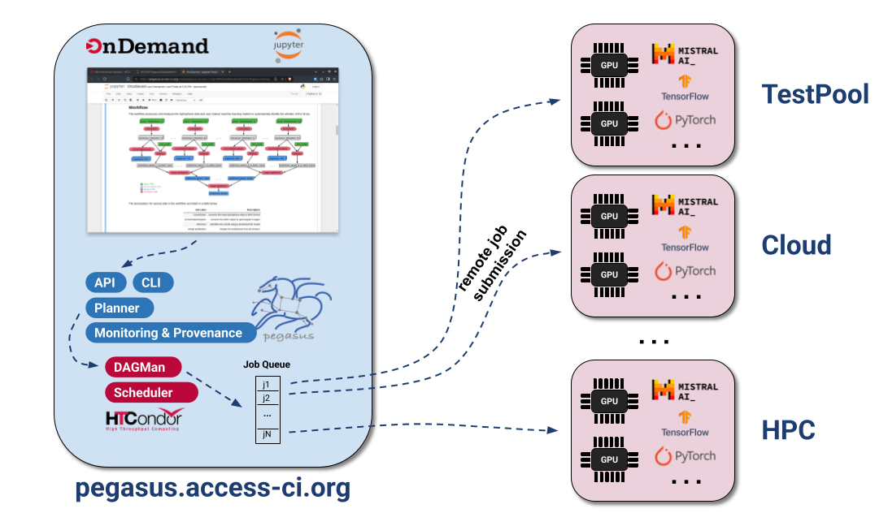

::: {.callout-note}
This page is work in progress.
:::

This module introduces science gateways — web-based portals that provide researchers 
with simplified access to advanced cyberinfrastructure (CI) resources without requiring 
deep technical knowledge of the underlying systems.

## What are Science Gateways?

Science gateways are community-developed platforms that provide scientists, engineers, 
and students with browser-based access to computing, data, and other resources needed 
to advance research and education in their fields.

A science gateway typically provides a **web-based interface** that abstracts away 
the complexity of the underlying CI resources, allowing researchers to focus on their 
scientific work rather than the technical details of running jobs on HPC clusters 
or managing data across distributed systems.

According to the [Science Gateways Community Institute (SGCI)](https://sciencegateways.org/), 
a science gateway is:

*A community-specific set of tools, applications, and data collections that are 
integrated together via a standards-based cyberinfrastructure, providing a 
customized user interface for a specific research community.*

Science gateways can take many forms:

- **Web portals** — Browser-based interfaces to submit and monitor jobs on HPC clusters
- **Domain-specific platforms** — Tailored interfaces for specific scientific communities 
  (e.g., genomics, climate science, materials science)
- **Workflow execution environments** — Platforms that allow users to compose and 
  run complex scientific workflows without command-line expertise
- **Data management platforms** — Tools for managing, sharing, and analyzing large 
  datasets across distributed storage systems

Examples of science gateways include:

- **Open OnDemand** — A web portal for accessing HPC clusters, deployed on most ACCESS resources
- **Galaxy** — A web-based platform for bioinformatics and data analysis
- **ACCESS Pegasus** — A gateway for running Pegasus workflows on ACCESS resources
- **nanoHUB** - a diverse community of nanotechnology researchers and educators
- **CIPRES Science Gateway** — A platform for phylogenetic inference using national CI

## How Can Science Gateways Help Researchers?

Science gateways lower the barrier to entry for using advanced CI resources in 
several important ways.

### Ease of Access

Traditional HPC clusters require users to:

- Install and configure SSH clients
- Learn command-line interfaces
- Understand job scheduler syntax (SLURM, SGE, PBS, etc.)
- Transfer files manually using `scp` or similar tools

Science gateways eliminate these barriers by providing intuitive web-based interfaces 
that work directly in your browser — no software installation required.

### Domain-Specific Interfaces

Rather than providing a generic command-line interface, science gateways often 
provide interfaces tailored to specific scientific workflows. For example, a 
gateway for structural biology may offer tools specifically designed for protein 
structure analysis, hiding the complexity of running those analyses on HPC clusters.

### Democratization of Computing

Science gateways make advanced computing resources accessible to a broader community 
of researchers, including:

- Researchers at smaller institutions without dedicated HPC staff
- Students and early-career researchers learning to use CI resources
- Domain scientists without a strong computational background
- Researchers who need to run occasional (not routine) computations on national resources

### Reproducibility and Collaboration

Many science gateways provide features that enhance reproducibility and collaboration:

- **Shared workflows** — Users can share analysis pipelines with colleagues
- **Provenance tracking** — The gateway records what was run, when, and with what inputs
- **Community resources** — Pre-built tools and workflows contributed by the broader community

## Open OnDemand

[Open OnDemand](https://openondemand.org/) (OOD) is an open-source, web-based platform 
developed by the Ohio Supercomputer Center (OSC) that provides browser-based access 
to HPC resources. It is widely deployed across academic HPC centers and is the 
standard web portal available on most ACCESS resources.

Open OnDemand allows researchers to:

- Access HPC cluster resources without any client software installation
- Browse and manage files on the cluster filesystem
- Submit and monitor batch jobs through a graphical interface
- Launch interactive applications including Jupyter notebooks, RStudio, MATLAB, and more

### Key Features of Open OnDemand

**File Manager**

The built-in file manager lets you browse the cluster filesystem, upload and download 
files, and edit text files directly in your browser — without configuring SFTP clients 
or using the `scp` command.

**Job Composer**

The job composer provides a form-based interface for creating and submitting batch 
jobs to the cluster scheduler. It supports job templates so you can create new 
submissions based on previously run jobs, reducing the need to remember scheduler 
syntax.

**Interactive Applications**

One of the most powerful features of Open OnDemand is the ability to launch 
interactive applications that run directly on cluster compute nodes. Common 
interactive applications available include:

- **Jupyter Notebooks** — Run Python, R, and Julia notebooks on HPC compute nodes, 
  giving you interactive data analysis with access to the cluster's memory and CPUs
- **RStudio** — A full-featured RStudio environment running on cluster resources
- **MATLAB** — Interactive MATLAB sessions with cluster-scale compute
- **Remote Desktop** — Full graphical desktop sessions for applications that require 
  a GUI

**Shell Access**

Open OnDemand provides a web-based terminal that gives you command-line access to 
the cluster login node directly in your browser, without needing an SSH client. 
This is especially attractive for novice users or first time users, who need 
terminal access to a large HPC resource and need to login to the resource using
2 factor authentication.

### Accessing Open OnDemand on ACCESS Resources

Most ACCESS HPC resources have Open OnDemand deployed. To access a cluster via 
Open OnDemand, navigate to the resource's portal URL, authenticate with your 
ACCESS credentials, and you will be presented with the dashboard.

| ACCESS Resource | Open OnDemand URL                              |
|-----------------|------------------------------------------------|
| Anvil (Purdue)  | https://ondemand.anvil.rcac.purdue.edu         |
| Bridges-2 (CMU) | https://ondemand.bridges2.psc.edu              |
| Delta (NCSA)    | https://login.delta.ncsa.illinois.edu          |
| Expanse (SDSC)  | https://portal.expanse.sdsc.edu                |

A full list of ACCESS resources with Open OnDemand is available at 
[support.access-ci.org/tools/ondemand](https://support.access-ci.org/tools/ondemand).

### Launching a Jupyter Notebook via Open OnDemand

Here is a walk-through of launching a Jupyter Notebook on the Expanse cluster 
at SDSC using Open OnDemand:

::: {.callout-note}
In order to run the notebooks, you need to have a user account at SDSC. 
This example, is for illustration purposes.
:::

1. Navigate to `https://portal.expanse.sdsc.edu` and log in with your ACCESS credentials.
2. Click on **Interactive Apps** in the top navigation menu.
3. Select **Jupyter Notebook** from the list of available applications.
4. Fill in the job parameters on the form:
   - **Account**: your ACCESS allocation account name
   - **Partition**: `shared` (for single-node jobs) or `compute`
   - **Number of cores**: e.g., `4`
   - **Memory**: e.g., `16 GB`
   - **Walltime**: e.g., `2:00:00`
5. Click **Launch** to submit the interactive job to the scheduler.
6. Wait for the job to start — the status will change from *Queued* to *Running*.
7. Click **Connect to Jupyter** to open the notebook interface in a new browser tab.

Once connected, you have a fully functional Jupyter environment with direct access 
to the cluster's compute resources, shared filesystems, and installed software modules.

::: {.callout-tip}
Interactive jobs on Open OnDemand behave like any other batch job — they consume 
allocation credits for the time requested. Request only what you need, and 
remember to close your session when done to release the resources back to the pool.
:::

## ACCESS Pegasus: A Science Gateway for Workflow Execution

[ACCESS Pegasus](https://support.access-ci.org/tools/pegasus) is a science gateway 
that provides researchers with a ready-to-use environment for running 
[Pegasus Workflows](https://pegasus.isi.edu) on ACCESS resources — without needing 
to install or configure Pegasus themselves.

As discussed in [DC101](../DC101/scientific-workflow-management.md), Pegasus WMS 
allows users to model their computational pipelines as workflows that execute 
on distributed computing resources. ACCESS Pegasus delivers this capability as a 
managed service, making it especially accessible to researchers new to workflow systems.

### What is ACCESS Pegasus?

ACCESS Pegasus is an Open OnDemand based Science Gateway, that is maintained by the
Pegasus team at the University of Southern California's Information 
Sciences Institute (USC/ISI). 
It provides:

- A **pre-configured Pegasus environment** on an ACCESS-connected submit host
- Direct connectivity to multiple ACCESS resources (Expanse, Anvil, Bridges-2, etc.)
- Access to the **OSG OSPool** for high-throughput computing workloads
- Support from the Pegasus development team

ACCESS Pegasus gives you a ready-to-use Pegasus installation that is already 
configured to submit workflows to major ACCESS resources, removing the configuration 
burden from the researcher entirely.

### ACCESS Pegasus Jupyter Setup

ACCESS Pegasus allows users to launch Jupyter notebooks from where they can
submit workflows to a variety of resources. It is important to note that in
case of ACCESS Pegasus, the notebooks are not launched on a node in a HPC
cluster, as normally is the case with Open OnDemand setup. 

In particular, there is a clear separation between the environment where
the notebooks runs and where the compute jobs in the workflow execute. 
Notebooks runs on pegasus.access-ci.org, while the job is executed on
any available HTCondor execution points. 

### Why Use ACCESS Pegasus?

For CHESS researchers looking to scale their data processing pipelines to national CI 
resources, ACCESS Pegasus offers several advantages over setting up Pegasus locally:

- **Zero configuration** — No need to install Pegasus or write site catalogs for 
  each ACCESS resource. The submit host is pre-configured and maintained by the 
  Pegasus team.
- **Multi-site execution** — A single workflow can span multiple ACCESS resources 
  and the OSPool, allowing Pegasus to intelligently route work to available resources.
- **Fault tolerance** — Pegasus' built-in retry and checkpointing mechanisms ensure 
  your workflow completes even if individual jobs fail or a resource becomes temporarily 
  unavailable — particularly valuable for long-running CHESS data analysis pipelines.
- **Provenance** — A full record of what ran, where, and when is maintained, 
  supporting reproducibility of your analyses.
- **Expert support** — Direct access to the Pegasus development team, who can help 
  you adapt your existing analysis pipeline into a portable workflow.

### How to Get Started

1. **Get an ACCESS account** — Register at 
   [operations.access-ci.org/identity/new-user](https://operations.access-ci.org/identity/new-user) 
   if you do not already have one.

2. **Get an allocation (Optional)** — To try out ACCESS Pegasus and do the training notebooks,
   you don't need an allocation. For production workflows, users can tie-in
   their own allocation. Users can easily start with an EXPLORE allocation on one of the 
   ACCESS resources. See the [DC200](../DC200/computing-with-ci-ecosystem.md) module 
   for details on requesting an allocation.

3. **Request ACCESS Pegasus access** — Visit 
   [support.access-ci.org/tools/pegasus](https://support.access-ci.org/tools/pegasus) 
   and click the Try Pegasus button, to login to the gateway using your ACCESS ID.

   
### Running Your First Workflow on ACCESS Pegasus

### ACCESS Pegasus Support

The Pegasus team provides support for ACCESS Pegasus users through the same channels 
as the broader Pegasus community:

- **Email** — Support requests and bug reports can be sent to `pegasus-support@isi.edu`
- **Slack** — Join the Pegasus users Slack workspace by requesting an invite at 
  `pegasus-users.slack.com` or by emailing `pegasus-support@isi.edu`
- **ACCESS Support Portal** — [support.access-ci.org](https://support.access-ci.org)

## Summary

Science gateways like Open OnDemand and ACCESS Pegasus significantly reduce the 
barriers to using advanced computing resources. Whether you need to run interactive 
analyses in a Jupyter notebook on a national HPC cluster, or orchestrate complex 
multi-step workflows across distributed resources, science gateways provide 
the tools to do so without deep expertise in HPC system administration.

For CHESS researchers, the practical takeaways are:

1. **Open OnDemand** is the easiest way to get started with ACCESS HPC resources — 
   open a browser, log in, and launch a Jupyter notebook directly on the cluster.
2. **ACCESS Pegasus** is the best path for researchers who want to run Pegasus-based 
   workflow pipelines on national CI resources without the overhead of setting up 
   and configuring Pegasus themselves.
3. Both tools work seamlessly with the ACCESS allocation described in the 
   [DC200](../DC200/computing-with-ci-ecosystem.md) module.
