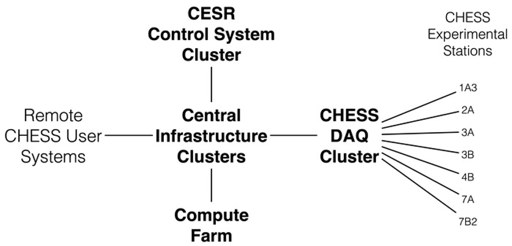
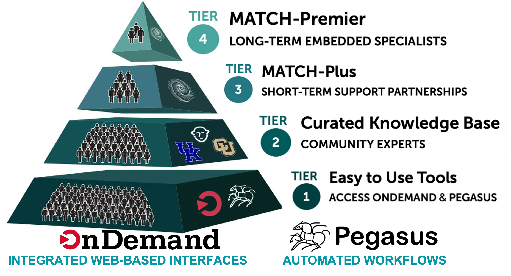

::: {.callout-note}
This page is work in progress.
:::


This module provides an overview of the various Cyberinfrastructure (CI) resources 
available to a CHESS researcher and more broadly to all the researchers based in the US.

Before we go into the various offerings available, it is useful to recap what we mean
by CI. A widely used and accepted definition of CI by
[Craig A. Stewart et al](https://dl.acm.org/doi/10.1145/1878335.1878347) is as follows:

*Cyberinfrastructure consists of computing systems, data storage systems, advanced
instruments and data repositories, visualization environments, and people, all linked
together by software and high performance networks to improve research productivity and
enable breakthroughs not otherwise possible.*

As a CHESS researcher, you have access to the following CI resources that can 
help you with computing

- CHESS CI Resources at Cornell
- ACCESS
- PATh / OSG

## Overview of CHESS Operational Workflow

Below is a high level overview of an overall chess operational workflow from the time 
a researcher puts in a proposal to use a beamline at CHESS to data collection from
the beamline; and then it's subsequent data processing and analysis before final 
data curation on the outputs is done. 


CHESS’ workflow complexity is the length of time spent performing a typical data
analysis. According to a CHESS survey conducted a few years back, CHESS’ workflow complexity
ranges from 1 month to 24 months among survey respondents (with the average being
7.2 months). For the most complex workflows (12 months or longer), researchers often
run into challenges regarding completing their data processing within the defined time 
constraints. 

Use of National CI resources, can especially help CHESS researchers in the following
areas

- Processing data (reduction, analysis, simulation, interpretation), handling large 
  data sets, leveraging existing software and CI.
- Metadata management, Open Science/FAIR and data curation.


## CHESS CI Resources at Cornell

The CLASSE cyberinfrastructure (CI) consists of an interconnected series of h
high-availability server clusters (HACs), data acquisition systems, control systems, 
compute farms, and workstations. Most of these systems run either Scientific Linux 
or Windows on commodity 64-bit Intel-based hardware and are centrally managed 
using Puppet. The median age of key CI components is approximately 5 years, with 
an average refresh rate of once every 10 years. The picture below provides an 
overview of the CHESS CI



### DAQ Cluster

DAQ Cluster is the Data Acquisition System that runs on a dedicated server cluster. 
Makes available to researchers about **2PB** of storage for raw data collection, analysis, 
and simulation. Data collected at the stations written directly to the DAQ over either 
NFS or Samba and is immediately available for processing/analysis by users on the
Compute Farm.

CHESS users can also download their data remotely using the CLASSE Globus Connect Server 
or via SFTP. 
 

### Compute Farm

The HPC Cluster at CHESS/CLASSE is a central resource consisting of

- central resource of 60+ enterprise-class Linux nodes (with around 800 CPUs)
- 4.5TB of memory
- uses SGE as a front-end queueing system
- supports interactive, batch, parallel, and GPU jobs
- ensures equal access to the Compute Farm for all users.
 

### Getting access

In order to access the Cornel CI resources, you need a 
Cornell Laboratory for Accelerator-based ScienceS and Education(CLASSE) account.

You can get one by following the instructions at **XXX**.

### Job Submission

The CHESS cluster uses **SGE** as the front end scheduling system to submit jobs.

In general, there are two basic steps to submitting a job

1. Create a shell script containing the commands to be run
2. Submit this script to the Compute Farm using the qsub command.

Below is a simple shell script **myscript.sh** that you can submit to the SLURM
cluster if you are logged onto lnx201.

```{.bash}
[user@lnx201 ~]$ cat myscript.sh
#!/bin/bash
echo Running on host: `hostname`.
echo Starting on: `date`.
sleep 10
echo Ending on: `date`.
#$ -q all.q
#$ -S /bin/bash
#$ -l mem_free=8G
```

In order to submit it to the cluster you can use *qsub* command

```{.bash}
[user@lnx201 ~]$ qsub -q all.q myscript.sh
```

Detailed instructions about this can be found at
[CLASSE Wiki](https://wiki.classe.cornell.edu/Computing/GridEngine).


## ACCESS

[ACCESS CI](https://access-ci.org/about/)  is a program established and
funded by the National Science Foundation (NSF) to help researchers and 
educators utilize the nation’s advanced computing systems and services.
ACCESS is a collection of both large and experimental HPC resources.

ACCESS provides a wide range of resources and services:

- Systems ranging from supercomputers to smaller specialized compute 
  clusters, each with a different focus and unique set of capabilities 
- Data and storage services
- Expertise to help you make effective use of resources, remove barriers,
  and achieve your goals
- Scientific applications
- Science gateways 

Some of the resources available are listed below 

| Leadership Class |                             |
|------------------|-----------------------------|
| Frontera         | University of Texas, Austin |


| Innovative Production Systems |                                  |
|-------------------------------|----------------------------------|
| Anvil                         | Purdue University                |
| Bridges 2                     | Carnegie-Mellon University       |
| Delta/ DeltaAI                | U of Illinois Urbana-Champaign   |
| Expanse                       | U of California, San Diego       |
| Jetstream 2                   | University of Indiana + Partners |
| Stampede 2                    | U of Texas, Austin               |


| Prototypes/Testbeds |                            |
|---------------------|----------------------------|
| Neocortex           | Carnegie-Mellon University |
| Voyager             | U of California, San Diego |
| Ookami              | Stonybrook University      |
| NRP                 | U of California, San Diego |
| ACES                | Texas A&M University       |

| Cloud Technology Resources |                            |
|----------------------------|----------------------------|
| Cloudbank                  | U of California, San Diego |
| CloudLab                   | University of Utah         |
| Chameleon                  | University of Chicago      |


Of the resources above, the leadership class system and most of the Innovative
Production Systems are HPC clusters, very similar to the CHESS HPC
cluster at Cornell. The main difference being that they use **SLURM** 
as their frontend queueing system instead of SGE.

### ACCESS User Registration

In order to use ACCESS resources, you first need to request an ACCESS user account.
This account is required for you to login to the ACCESS website, manage
your allocations (more on it in the next section). 

Getting an ACCESS user account is fairly straightforward. Instructions for
getting it can be found [here](https://operations.access-ci.org/identity/new-user).
Using an **existing University account** when registering with ACCESS **simplifies 
the sign-up process** and enables you to log in to ACCESS using that existing account. 

### Getting an Allocation

To get started, you need an ACCESS project and some resource units you can spend. 
Your ACCESS project and resource units are what we refer to as an Allocation. 
An allocation is your project to use a portion of a shared resource.

Through ACCESS, you can get an allocation to use computing and data 
resources to accomplish your research or classroom objectives.

You can get allocation for 4 different types of projects which are
listed below.

- **EXPLORE** — Great for resource evaluation, graduate student projects,  
  small classes and training events, benchmarking, code development and 
  porting, and similar small-scale uses.

- **DISCOVER** — Designed for research grants with modest resource needs, 
  Campus Champions, large classes and training events, graduate student 
  projects, benchmarking and code testing at scale, and gateway development.

- **ACCELERATE** — Best for experienced users with mid-scale resource needs, 
  consolidating multi-grant programs, collaborative projects, preparing for 
  Maximize ACCESS requests, and gateways with growing communities.

- **MAXIMIZE** — The choice for large-scale research activities that need
  more resources than the limit for Accelerate ACCESS projects.

The *EXPLORE* requests are easiest to get with *MAXIMIZE* the hardest
(in terms of supporting documentation required). The *EXPLORE* request
will get you 400,000 ACCESS credits/SUs to start with, which is enough
to explore suitability of these resources for your processing needs. 

More details including a detailed comparison table can be found 
[here](https://allocations.access-ci.org/project-types).

### Logging to the ACCESS resource

Once, you have your allocation approved then in the 
[Allocations portal](https://allocations.access-ci.org)  you
can assign your credits to a particular resource that you are 
interested in. Once that is done, the Resource Provider will contact
you to setup your local HPC accounts. 

Once that is done, you can 
* register  your ssh keys to login to your account on the HPC resource.

Additionally, most of the ACCESS resources have 
[Open OnDemand](https://support.access-ci.org/tools/ondemand) installed,
that allow you to access and login to the clusters using a web front-end.
Open OnDemand is an easy-to-use web portal that is being deployed on
ACCESS resources to allow researchers to compute from anywhere 
without client software or command-line interface, and significantly
speed up the time to science.

### Submitting Jobs

You can login to the headnodes of these resources, and submit jobs
to the SLURM clusters in a similar fashion that you submit jobs on the
CHESS cluster. 

Additionally, all the ACCESS resources that have an Open OnDemand install, 
allow you to launch **Jupyter notebooks** to run your analysis.

You can also use workflow systems such as 
[Pegasus](https://pegasus.isi.edu) to run 
your analysis pipelines on ACCESS resources. One easy way to explore
Pegasus workflows is to use 
[ACCESS Pegasus](https://support.access-ci.org/tools/pegasus).

### ACCESS Support

ACCESS does provide support for researchers looking to leverage their
resources. The support comes in various flavors as illustrated in the picture
below.

[ACCESS Support](https://support.access-ci.org) provides researchers with 
access to 

- Tools, growing knowledge base
- Match-making with experts
- Student engagement
- Engagement from community

ACCESS provides [Match services](https://support.access-ci.org/match/overview)
(Tier 3 and Tier 4) which connects researchers with experts to help you select 
the right system, run on a supercomputer, and solve basic code and research problems.



## PATh / OSG

