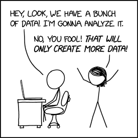

::: {.callout-note}
This page is work in progress.
:::

## What is _metadata_?

<!-- TODO -->

Mirriam-Webster dictionary defines [data][webster-data] as: "factual
information (such as measurements or statistics) used as a basis for
reasoning, discussion, or calculation", or: "information in digital
form that can be transmitted or processed."

[webster-data]: https://www.merriam-webster.com/dictionary/data

For our purposes, let us use the latter definition: data is
information in digital form that can be stored, transmitted, or
processed.  Our experiments may consume data, produce data, transmit
data between instruments and computers, and we might want to analyze
data to make sense of it.  We store data somewhere, for eventual use
and/or sharing.

[][xkcd-data-trap]

[xkcd-data-trap]: https://xkcd.com/2582/

What is _metadata_ then?

Metadata is data that describes data, and what that description says
depends on context.

For example, [EXIF](or "Exchangeable image file format") is image
metadata.  When you take a picture with cellphone, you get an image
file.  In addition to image data, this image file contains some
_metadata_ that describes the image: it would contain details such as
date and time when the picture was taken, location if available, lens
aperture and shutter speed, such things.

[EXIF]: https://en.wikipedia.org/wiki/Exif

For CHESS experimenters, metadata would be information about
observational or experimental data that provides a "fuller picture"
about the observation or experiment.

<!-- TODO -->

## What is annotation?

<!-- TODO -->

## What is DOI?

<!-- TODO -->

## References

- [Carpentries Incubator: Data and
  Metadata](https://carpentries-incubator.github.io/scientific-metadata/instructor/data-metadata.html)

  - [Carpentries Incubator Training Course Material: Fundamentals of
    Scientific Metadata](https://zenodo.org/records/10091708)

- [Metadata accounts: Achieving data and evidence in scientific
  research](https://pmc.ncbi.nlm.nih.gov/articles/PMC7323761/). Matthew
  S Mayernik, National Center for Atmospheric Research.

- [Observational Health Data Sciences and Informatics forums: How do
  we define “Metadata” and
  “Annotation?”](https://forums.ohdsi.org/t/how-do-we-define-metadata-and-annotation/4424)

- [Wikipedia page on Digital object
  identifier](https://en.wikipedia.org/wiki/Digital_object_identifier)

- [DOI Foundation: What is a
  DOI?](https://www.doi.org/the-identifier/what-is-a-doi/)

- [Scribbr: What is a DOI? Finding and Using Digital Object
  Identifiers](https://www.scribbr.com/citing-sources/what-is-a-doi/)

- [Long Term Ecological Research Network: Enriching Ecological Data
  Using Annotated Metadata](https://lternet.edu/stories/enriching-ecological-data-using-annotated-metadata/)
